# Hunt-AI

Artificial Intelligence-based image recognition for products usually sold on e-commerce sites. It includes 30 categories. Some of the categories contain forbidden products that prevented to sold in marketplaces.

> Used DarkNet53 API for training a Convolutional Neural Network. The CNN model that is trained has %90 output accuracy.

  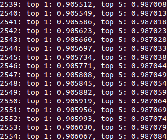

> You cannot use the UI without trained models weights.

## Sample Outputs

Shoe:

  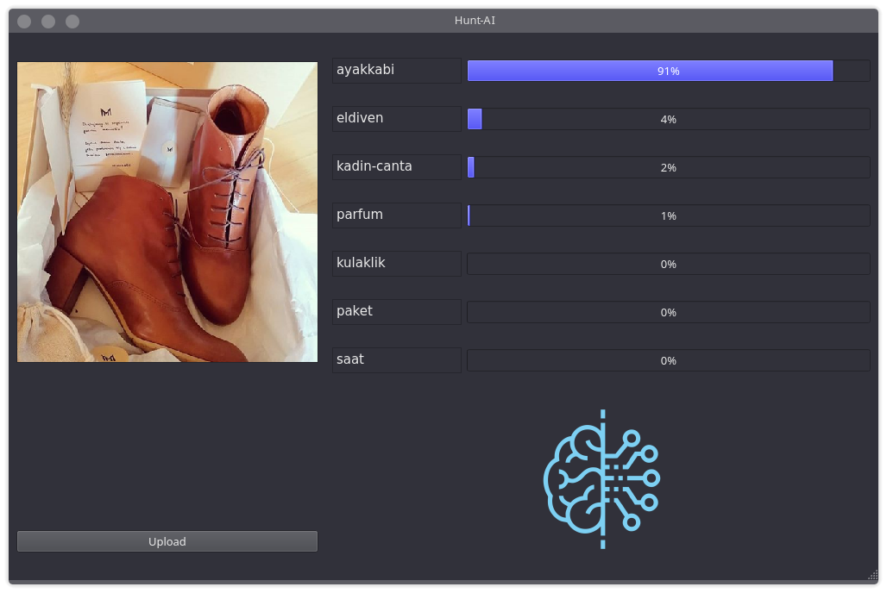

Pepper-gas:

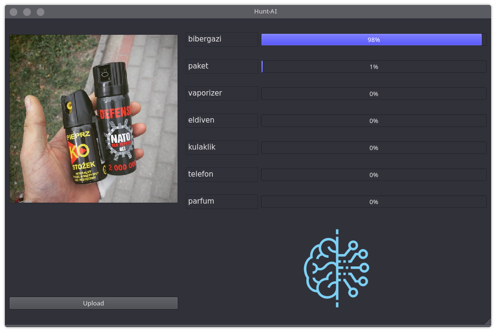

Cat:

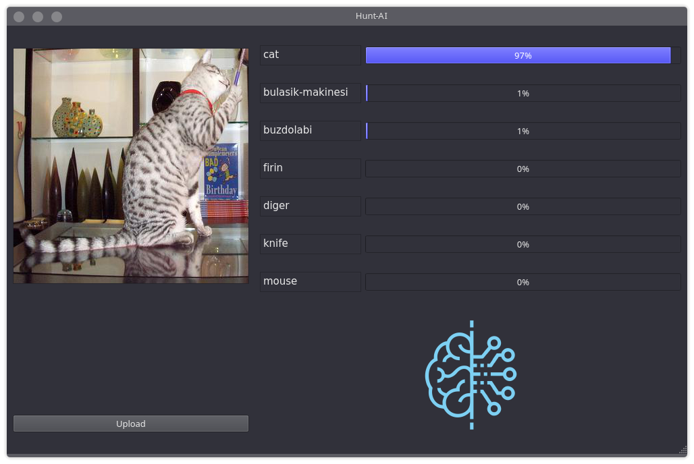

Chair:

Dog:

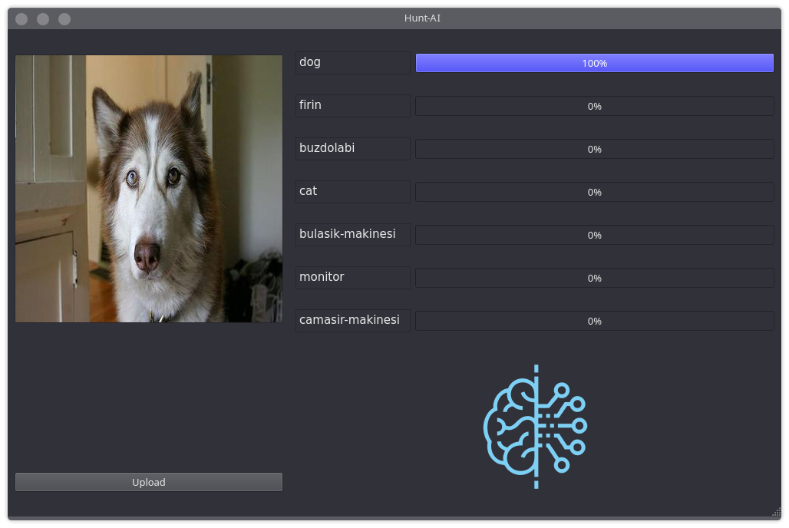

Liquor:

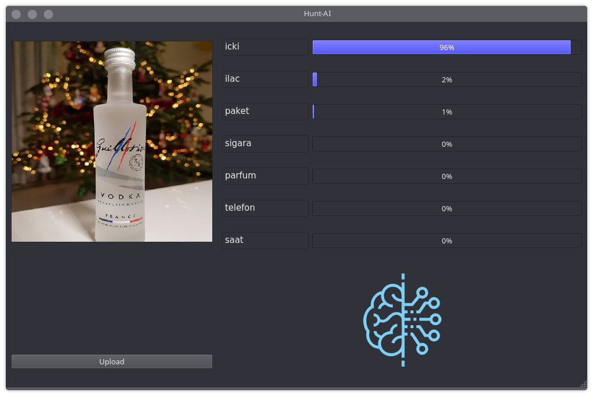

Drug:

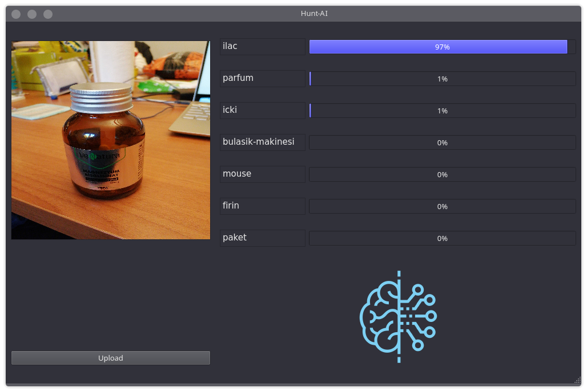

Knife:

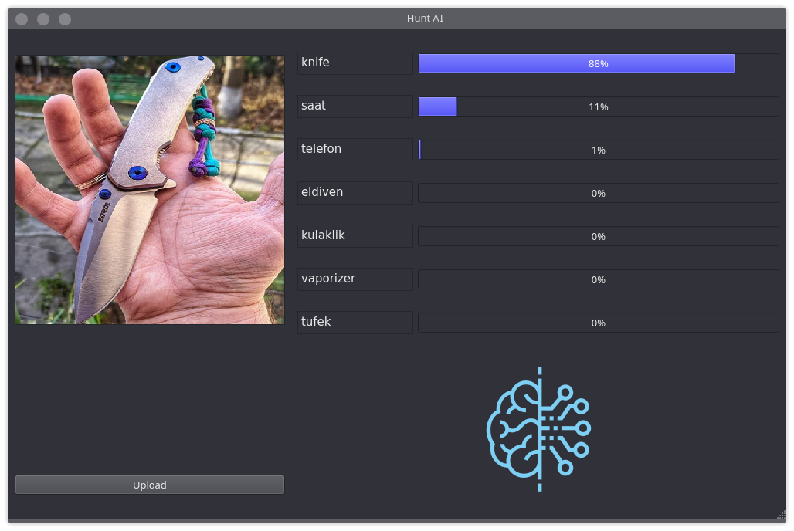

Cigarette box:

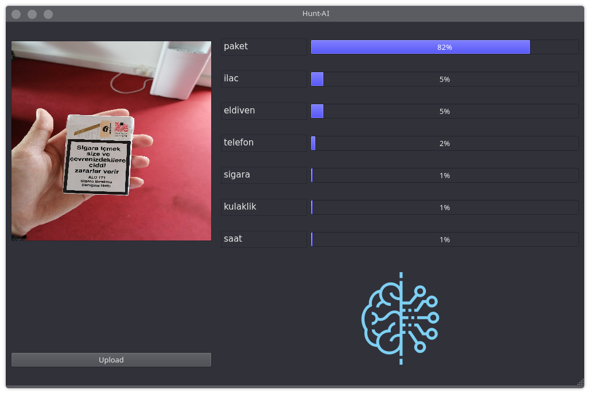

Pistol:

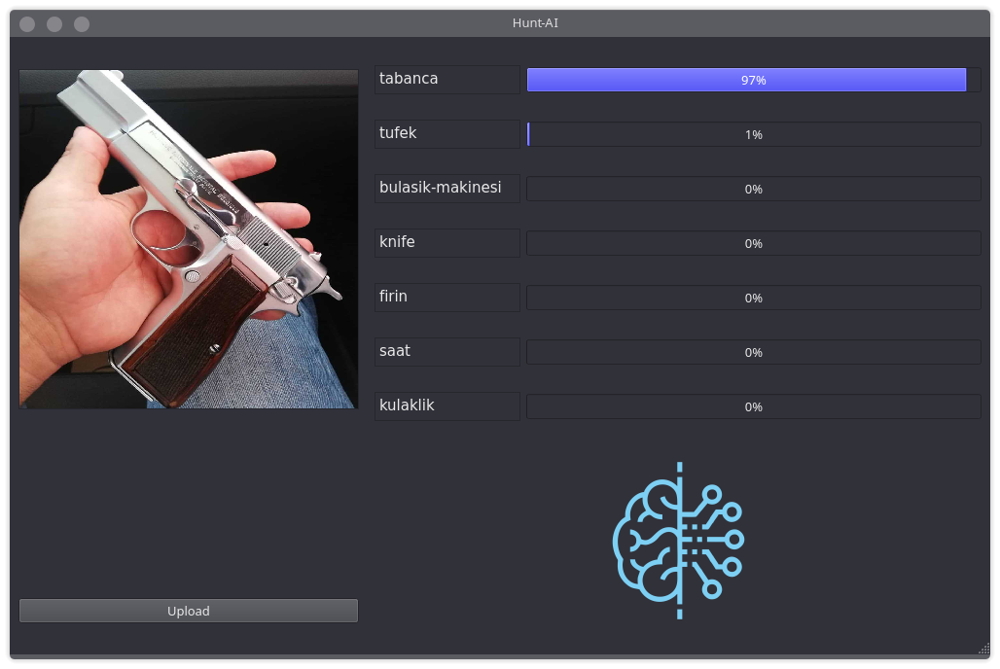

Taser:

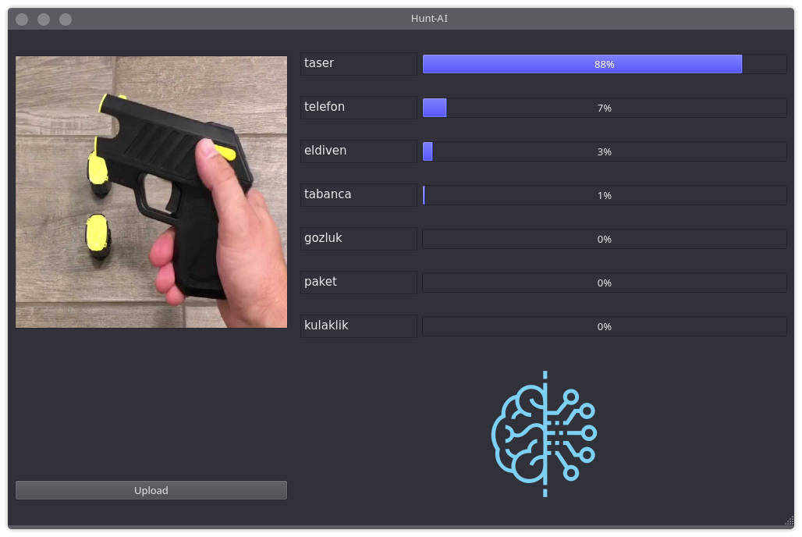

Rifle:

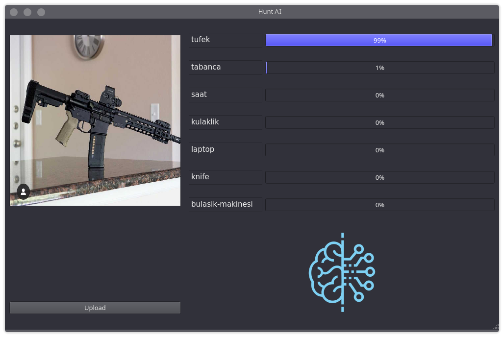

Vaporizer (e-cigarette):

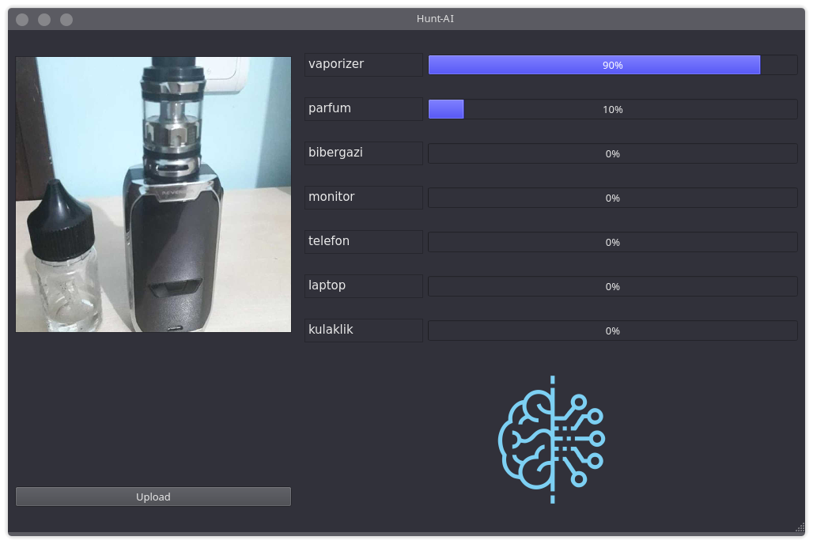
