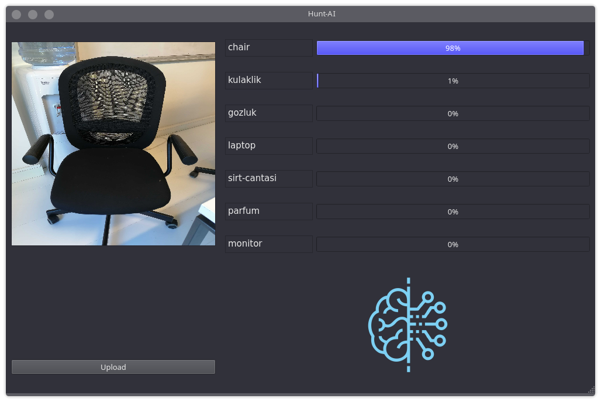

# Hunt-AI

Artificial Intelligence-based image recognition for products usually sold on e-commerce sites. It includes 30 categories. Some of the categories contain forbidden products that prevented to sold in marketplaces.

> Used DarkNet53 API for training a Convolutional Neural Network. The CNN model that is trained has %90 output accuracy.

  

> You cannot use the UI without trained models weights.

## Sample Outputs

Shoe:

  

Pepper-gas:

Cat:

Chair:

Dog:

Liquor:

Drug:

Knife:

Cigarette box:

Pistol:

Taser:

Rifle:

Vaporizer (e-cigarette):

